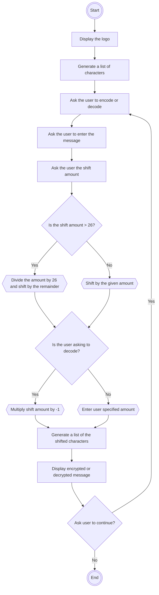

# Caesar-Cipher
Welcome to the Caesar Cipher Project

The project is meant to build a tool that is capable of encrypting and decrypting messages. 

## Key Objectives
* Encode and decode a message.
* The message may consist of more than one word and include numbers.

## The Results
When the program function activates, a display of the ascii art logo for the program title would be shown.  

Afterwards, the program first asks the user for the direction: to either encode and decode. 

Then it asks for the message and amount to shift the characters. 

Additionally, the program incorporates the capacity to encrypt special characters and digits.

Finally, the program would ask if the user would like to continue encoding or decoding messages.

The Graphic User Interface:

## The Process

